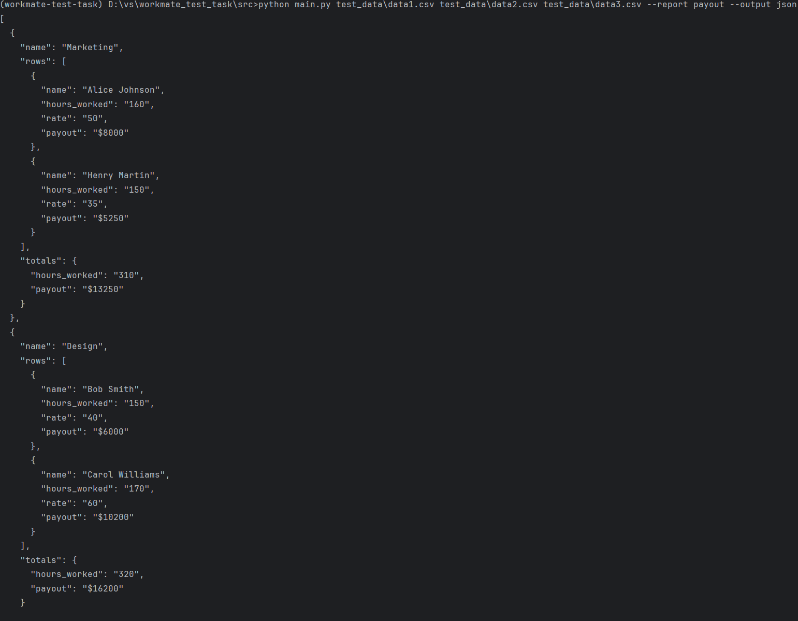
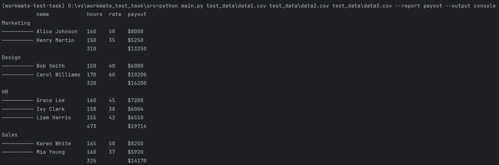

## Запуск реализован как описано в тз, однако также добавлен обязательный флаг --output с вариантами json и console
### Пример запуска с json:
#### Linux
```shell
cd src &&
python3 main.py files\data1.csv files\data2.csv files\data3.csv --report payout --output json
```
#### Win
```shell
cd src
python main.py files\data1.csv files\data2.csv files\data3.csv --report payout --output json
```
### Результат:

### и т.д.
### Пример запуска с console:
#### Linux
```shell
cd src &&
python3 main.py files\data1.csv files\data2.csv files\data3.csv --report payout --output console
```
#### Win
```shell
cd src
python main.py files\data1.csv files\data2.csv files\data3.csv --report payout --output console
```
### Результат:


## Добавление нового отчёта

Чтобы добавить новый отчёт:

1. Открой файл `settings.py`.
2. В словарь `REPORT_CONFIGS` добавь новую запись:

   * ключ — имя отчёта (используется в аргументе `--report` при запуске),
   * значение — конфигурация отчёта: список колонок, опции группировки, форматирование и т.п.

Пример с отчётом `payout` уже реализован:
[См. в `settings.py`](https://github.com/jmblx/test-task/src/settings.py)